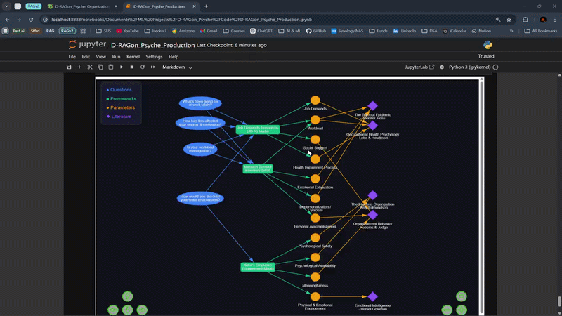
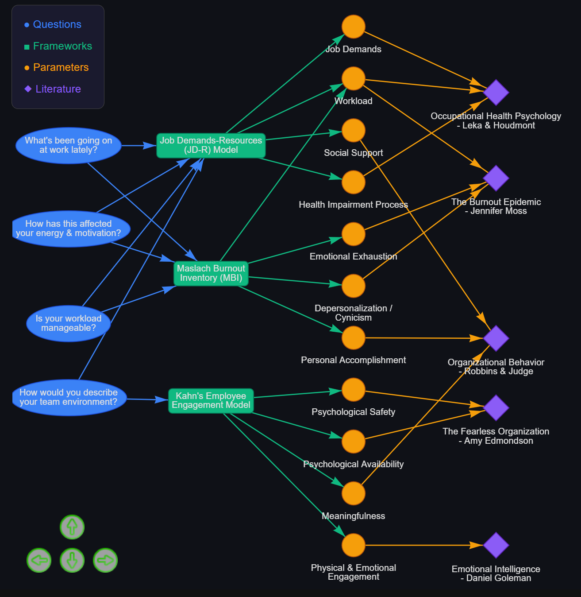

# 🐉 D-RAGon_Psyche
> *Because professional psychological support shouldn't cost ₹5,000/hour.*

## Problem Statement

Professional psychological support remains inaccessible to most employees due to 
cost and organizational unavailability, resulting in unaddressed workplace stress, 
burnout, declining productivity, and measurable losses for organizations.

## Project Objective

D-RAGon_Psyche is a fully local, privacy-preserving Retrieval-Augmented Generation 
(RAG) pipeline built over 17 organizational psychology books. It converts free-text 
employee input into evidence-backed, cited workplace wellbeing recommendations 
grounded in established psychological frameworks — including the Job Demands-Resources 
model (JD-R), Maslach Burnout Inventory (MBI), and Kahn's engagement theory — with 
zero cloud dependency and rigorous evaluation across retrieval precision, faithfulness, 
and answer quality metrics.

📖 [Full Documentation → Notion](https://www.notion.so/D-RAGon_Psyche-Organizational-Psychology-Knowledge-Retrieval-System-311ff95a70998028839ed8f591fde4fe)

---

## How It Works

```
4 Guided Questions → Narrative Synthesis (LLM)
    ↓
Parameter Scoring — 11 psych parameters scored 0–10
    ↓
ChromaDB Retrieval — top-4 chunks from 8,059 indexed
    ↓
Psychologist Synthesis (LLM) — 3 evidence-backed recommendations + cited sources
    ↓
Conversational Follow-up — history-aware free chat mode
```
---

## Demo


---

## Features

- **Guided intake** — 4 structured questions build a psychological case narrative
- **RAG retrieval** — BGE-M3 embeddings over 17 org psych books
- **Parameter scoring** — JD-R, MBI, and Kahn's frameworks scored per session
- **Conversational mode** — follow-up questions with query rewriting and 10-turn history
- **Knowledge graph** — interactive Pyvis graph mapping questions → frameworks → parameters → literature
- **Fully local** — no API fees, no data leaves your machine

---

## Setup

```bash
# 1. Clone the repo
git clone https://github.com/Daddy-Myth/D-RAGon_Psyche.git
cd D-RAGon_Psyche

# 2. Create environment
conda create -n dragon_v2 python=3.11
conda activate dragon_v2

# 3. Install dependencies
pip install -r requirements.txt

# 4. Pull the LLM
ollama pull llama3.1

# 5. Add your own org psychology PDFs to Data/Raw_Books/
#    (see Notion docs for the full book list)

# 6. Open D-RAGon_Psyche_Production.ipynb and run all cells
```

---

## Project Structure

```
D-RAGon_Psyche/
├── Data/
│   ├── Raw_Books/                    # PDF knowledge base (not included, see docs)
│   └── Eval_Stuff/                   # Benchmark files
├── Chroma/                           # Vector store (generated, gitignored)
├── D-RAGon_Psyche_Production.ipynb   # Production notebook
├── D-RAGon_Psyche.ipynb              # Dev notebook
└── README.md
```

---

## Tech Stack

| Component | Tool |
|---|---|
| Embeddings | BAAI/bge-m3 |
| Vector Store | ChromaDB |
| LLM | Llama-3.1-8B via Ollama |
| Orchestration | LangChain |
| UI | Gradio |
| Knowledge Graph | Pyvis |
| Parameter Scoring | Matplotlib |
| Hardware | RTX 4080 12GB / 32GB RAM / i9 |
| Language | Python 3.11 / CUDA 12.4 |

---

## System Pipeline (Detailed)

```
Guided conversational flow (4 questions) → conv_controller
    ↓
LLM Call #1: QA pairs → natural language narrative (org psych case summary)
    ↓
Parameter Scoring: narrative → LLM → 11 psychological parameters scored 0–10
    ↓
Narrative embedded → ChromaDB retrieval → top-10 dense results
    ↓
LLM Call #2: Narrative + chunks + prompt → 3 evidence-based recommendations + sources
    ↓
User receives recommendations + cited books
    ↓
FREE CHAT MODE — query_rag_hist handles follow-ups with conversation history (last 10 turns)
```

### Guided Intake — 4 Questions

1. "What's been going on at work lately that's been bothering you?"
2. "How has this been affecting you — things like your energy, motivation, or how you feel at the end of the day?"
3. "Do you feel the amount of work you're given is manageable, or does it feel overwhelming?"
4. "How would you describe the environment in your team — supportive, stressful, or something else?"

Answers are compressed into a single narrative via an LLM call before retrieval. This improves retrieval quality by providing semantic coherence instead of fragmented short answers.

### Conversational Follow-up Mode

After the initial recommendations, the system transitions to a free-chat mode powered by `query_rag_hist`.

**Query Rewriting:** Before retrieval, follow-up questions are rewritten into standalone queries using conversation history (last 10 turns). This ensures the retrieval step gets a coherent, self-contained query rather than a context-dependent fragment.

```
"What should I say to them?"
  → "What should an employee say to their manager about feeling emotionally exhausted and overloaded?"
```

The follow-up prompt instructs the LLM to respond conversationally in 2–3 sentences, stay grounded in the retrieved context, offer alternatives if pushed back on, give practical steps if asked for implementation, and not generate new recommendations unless explicitly asked.

**History Management:** History stored as list of `(role, message)` tuples. Last 10 turns used for both query rewriting and response generation. History immutable inside function (no side effects) — new history returned and managed by Gradio state.

---

## Corpus Architecture

The knowledge base is structured into three hierarchical layers to maintain domain coherence and retrieval precision.

### Layer 1 — Core Organizational Psychology (Foundational Layer)

These texts provide structured theoretical frameworks for workplace behavior, motivation, leadership, team dynamics, and organizational performance. This layer forms the conceptual backbone of the system.

1. Organizational Behavior — Robbins & Judge
2. Industrial and Organizational Psychology — Paul Levy
3. Work and Organizational Psychology — John Arnold
4. The Oxford Handbook of Organizational Climate and Culture — Schneider & Barbera
5. Leadership in Organizations — Gary Yukl

**Priority:** Highest | **Role:** Core domain grounding

### Layer 2 — Workplace Stress & Burnout (Application Layer)

These works focus on stress physiology, burnout mechanisms, coping strategies, and workplace wellbeing. This layer directly supports the system's stress and burnout-related query handling.

1. Occupational Health Psychology — Stavroula Leka & Jonathan Houdmont
2. The Burnout Epidemic — Jennifer Moss
3. Why Zebras Don't Get Ulcers — Robert Sapolsky
4. The Stress Management Handbook — Eva Selhub
5. Full Catastrophe Living — Jon Kabat-Zinn
6. The Relaxation Response — Herbert Benson
7. The Stress Proof Brain — Melanie Greenberg

**Priority:** High | **Role:** Applied stress management and burnout modeling

### Layer 3 — Behavioral & Cognitive Foundations (Support Layer)

These books provide foundational insights into decision-making, persuasion, cognitive bias, and emotional intelligence, strengthening contextual reasoning in workplace scenarios.

1. Thinking, Fast and Slow — Daniel Kahneman
2. Influence — Robert Cialdini
3. Pre-Suasion — Robert Cialdini
4. Emotional Intelligence — Daniel Goleman
5. The Fearless Organization — Amy Edmondson

**Priority:** Supportive | **Role:** Cognitive and interpersonal psychology grounding

### Corpus Statistics

| Stat | Value |
|---|---|
| Books | 17 |
| Pages | 8,047 |
| Total Tokens | 5,052,966 |
| Vector Chunks | 8,059 |
| Chunk Size | 1,200 tokens |
| Overlap | 300 tokens |
| Embedding Model | BAAI/bge-m3 |

---

## Technical Architecture

### PDF Ingestion

- **Library:** PyPDFLoader (LangChain Community)
- **Loading Strategy:** File-by-file iteration using `Path.glob()`
- **Metadata:** `source_book`, page-level metadata, chunk ID (`source_book:page:chunk_index`)
- **Boilerplate Filtering:** Pages under 200 chars and blacklisted phrases removed to reduce noise

### Token-Aware Chunking

- **Method:** RecursiveCharacterTextSplitter (LangChain)
- **Tokenizer:** AutoTokenizer (BAAI/bge-m3)
- **Chunk Size:** 1,200 tokens | **Overlap:** 300 tokens | **Min Threshold:** 200 tokens
- Token-based splitting ensures alignment with the embedding model's context window

### Embeddings

- **Model:** BAAI/bge-m3
- **Max Sequence Length:** ~8,192 tokens | **Dimensionality:** 1,024
- **Deployment:** Local (HuggingFace + LangChain)
- Switched from BGE-Large-EN-v1.5 (512 token limit) to BGE-M3 to prevent truncation of 1,200-token chunks

### Vector Database

- **Tool:** ChromaDB (persistent local)
- **Similarity:** Dense vector search (cosine)
- **Metadata Filters:** `source_book`, page number, document ID
- Incremental indexing enabled; supports rebuild during development

### Retriever

- **Stage 1:** Dense retrieval via Chroma, Top-K = 10
- **Stage 2:** *(V2 tested cross-encoder re-ranking — ms-marco-MiniLM-L-6-v2 — removed in final config, see eval notes)*
- **Final K sent to LLM:** 4 (top-10 dense only in current stable config)

### LLM

- **Model:** Llama-3.1-8B-Instruct via Ollama
- **Hardware:** RTX 4080 (12GB VRAM), 32GB RAM, i9
- **Cost:** Zero per-token fees — fully local inference

---

## Psychological Framework Mapping

The system's retrieval is grounded in three established org psych frameworks mapped to the 4 intake questions.

### Frameworks

| Framework | Focus |
|---|---|
| Job Demands–Resources (JD-R) | Workload, demands, resources, health impairment |
| Maslach Burnout Inventory (MBI) | Emotional exhaustion, depersonalization, accomplishment |
| Kahn's Engagement Model | Psychological safety, availability, meaningfulness |

### 11 Parameters

1. Job Demands
2. Workload
3. Social Support
4. Health Impairment Process
5. Emotional Exhaustion
6. Depersonalization / Cynicism
7. Personal Accomplishment
8. Psychological Safety
9. Psychological Availability
10. Meaningfulness
11. Physical & Emotional Engagement

### Questions → Frameworks Mapping

| Question | Frameworks Activated |
|---|---|
| Q1 — What's been going on at work? | JD-R, MBI |
| Q2 — Energy & motivation impact? | JD-R, MBI |
| Q3 — Is workload manageable? | JD-R, MBI |
| Q4 — Team environment? | Kahn, JD-R |

---

## Parameter Scoring

After intake, the narrative is passed to the LLM for structured scoring of all 11 parameters on a 0–10 scale.

**Scoring logic:**
- Stress/negative parameters (Job Demands, Workload, Health Impairment, Emotional Exhaustion, Depersonalization): 10 = severely elevated
- Protective/positive parameters (Social Support, Personal Accomplishment, Psychological Safety, Availability, Meaningfulness, Physical & Emotional Engagement): 10 = very high / healthy

Output is a JSON dict rendered as a colour-coded horizontal bar chart (JD-R blue / MBI green / Kahn amber) in the notebook. Intended as a diagnostic tool for researchers and evaluators.

**Example output (high burnout case):**

```json
{
  "Job Demands": 9,
  "Workload": 8,
  "Social Support": 1,
  "Emotional Exhaustion": 9,
  "Depersonalization / Cynicism": 9,
  "Psychological Safety": 0,
  "Meaningfulness": 1
}
```

---

## Evaluation

### Benchmark Design

- 20 scenarios across 7 topics: burnout, stress, motivation, leadership, team dynamics, psychological safety, emotional exhaustion
- 3 severity levels: low, medium, high
- Intentionally varied writing styles — fragmented, clinical, emotional

### Results

| Metric | V2 Baseline | Scenario Pipeline (Current) |
|---|---|---|
| Recall@4 | 0.733 | **1.0** |
| Precision@4 | 0.50 | **0.463** |
| Faithfulness (0–1) | 0.65 | **0.925** |
| Answer Quality (1–5) | 4.05 | **3.825** |

### Evaluation Notes

- Recall@4 = 1.0 because narrative synthesis produces richer queries than raw answers, improving retrieval coverage substantially
- Self-judge bias observed — local LLM collapses answer quality scores around 4.0; mitigated by forcing weakness identification before scoring and anchoring scale with harder criteria for score 5
- Faithfulness scores of 1.0 (minor leakage) concentrated in low/medium severity vague scenarios
- External judge (Claude / GPT-4) recommended for future work to eliminate self-evaluation bias

---

## Current Stable Configuration

| Parameter | Value |
|---|---|
| Chunk Size | 1,200 |
| Overlap | 300 |
| Embedding Model | BGE-M3 |
| Dense K | 10 |
| Final K | 4 |
| Reranker | None |
| Corpus Size | 17 books / 8,059 chunks |
| Controller | Conversational intake → narrative LLM call |
| Follow-up Mode | query_rag_hist with history[-10:] |
| Parameter Scoring | LLM JSON → matplotlib bar chart |
| UI | Gradio conversational chat |
| Hardware | RTX 4080 12GB / 32GB RAM / i9 |

---

## Knowledge Graph



> **Note:** This is not a neural network diagram. Each node type represents a distinct layer in the RAG pipeline — intake **Questions** (blue ellipses) map to psychological **Frameworks** (green boxes), which activate specific **Parameters** (orange dots), which are grounded in **Literature** (purple diamonds). Edges show which frameworks and books are activated per question.

---

## Future Improvements

- Manage the 2 LLM calls (narrative + recommendations) for production latency
- External LLM judge for unbiased evaluation
- `.py` script refactor from notebook
- FastAPI wrapper for REST API exposure
- Follow-up evaluation benchmark (conversational mode not yet benchmarked)
- Dynamic knowledge graph — highlight activated parameters per session
- Streaming responses for better UX
- Explore GraphRAG for cross-book thematic synthesis — e.g. "how do JD-R and MBI theories relate across the literature?" — which current chunk-based retrieval cannot answer holistically

---
